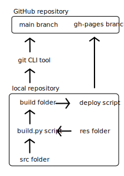

# Where?! Magazine Frontend

## How to upload a new post
This is the full guide on how to add a new post to the Where?! website. To do this you'll need to access both Python and Bash from the command line.

### Step 1: add to data.json file
You'll need to be familiar with JSON to edit the data.json file. Basically it's a human-readable file format that allows you to define data (text, numbers, true/false values, lists and dictionaries). Lists are just ordered collections of data separated by commas. They're contained within square brackets "[]". Dictionaries ("objects") are collections of key-value pairs, so you have some text in quotes with a colon and then some data. These pairs are comma-separated and contained within curly brackets "{}".
The data.json file is an object with "posts" and "authors" as the two keys. Both of them are lists of smaller objects. They are structured like so:

#### Post
- type: a string value (either "essay","video" or "gallery")
- name: a string value for the post's title
- desc: string value representing the front-page synopsis of the post
- date: sting that gives the month and year a post was uploaded (e.g. January 2021)
- thumbnail: string value, it's the path to the image you've chosen for the post's thumbnail (e.g. res/thumbnail.png)
- authors: a list of names that correspond to entries in the authors section of the file
- content: a list of strings where each string is either a filepath to an image or a paragraph. You don't need to specify, the program can identify filepaths
- font: the CSS name of a custom font you'd like to use for this post (optional)

#### Author
- name: the author's name, should be referenced in a post's authors list
- desc: short bio for the author
- img: filepath to the author's photo
- links: a list of objects with name (the text you'd like to see on the page) and url (where the text should take you when you click on it)

### Step 2: Rebuild the site and test
Open up the terminal from this project directory and run `python build.py`. It won't work if you're not using Python 3. I developed this with Python 3.8.5. Run `python -V` to figure out which version you have. If you're not using 3 then good luck, Python version control is notoriously terrible. Maybe I should have used Node.js for this...

Also, you can open build/index.html in your browser to view the site before deploying.

### Step 3: Deploy changes
Run `./deploy` in your terminal from this project directory to publish your changes to the site. The script will automatically rebuild the site and add git capability to the result. It will set the remote repository to our GitHub pages hosting service and begin an upload. You may be asked to enter your GitHub username and password. You'll need to be added to our remote repository or it won't let you upload.

### Step 4: Push this code to remote
Now you'll want to back up this source code project on GitHub. To do so, run the following:
```
git add .
git commit -m "Put a commit message here"
git push origin main
```
A commit message is some text that describes what changes you made since your last commit.

## Process map

